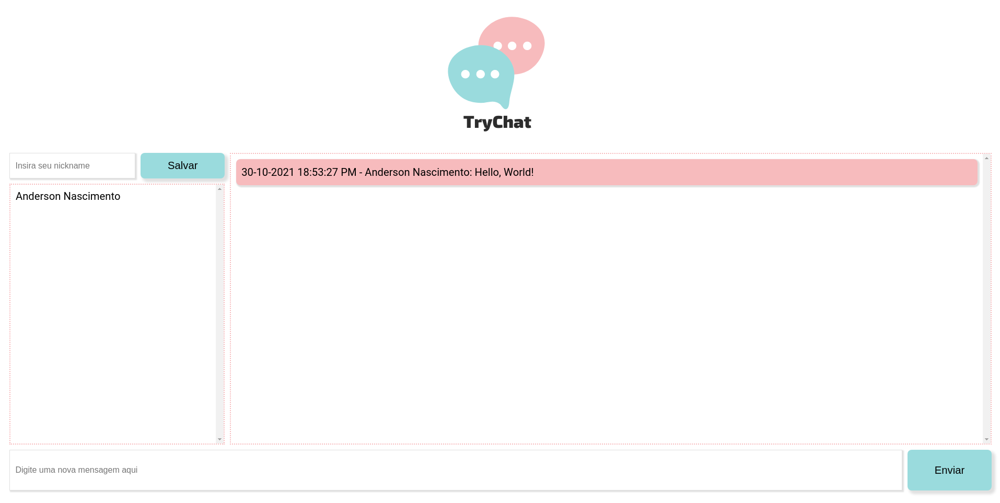

<p align="center">
  
</p>

<p align="center">
  
  
  

     
</p>

<h1 align="center">
    
</h1>

<br>

## 🧪 Tecnologias

Esse projeto foi desenvolvido com as seguintes tecnologias:

- [Express](https://expressjs.com/pt-br/)
- [Socket.io](https://socket.io/)
- [MongoDB](https://www.mongodb.com/pt-br)
- [Eslint](https://eslint.org/)
- [Stylelint](https://stylelint.io/)
- [EJS](https://ejs.co/)

## 📝 Padrão de Projeto

Esse projeto foi desenvolvido seguindo os padrões de projetos:
- MVC

## 🚀 Como executar

Clone o projeto e acesse a pasta do mesmo.

```bash
$ git clone git@github.com:AndersonNascimentoAFSN/WebChat.git
$ cd WebChat
```

Para iniciá-lo, siga os passos abaixo:
```bash
# Instalar as dependências
$ npm install

# Iniciar o projeto
$ npm run dev
```
O app estará disponível no seu browser pelo endereço http://localhost:3000.

## 💻 Projeto

Trychat é um Web chat perfeito para interagir com os amigos.

Este é um projeto desenvolvido para obtenção de nota do módulo de back-end do curso da ***[Trybe](https://www.betrybe.com/formacao-desenvolvimento-web)***.


## 🔖 Layout

Você pode visualizar o layout do projeto através do link abaixo:

- [Layout Web](https://www.figma.com/file/YgPuxiZvwnEw6AMYpBCHTI/TryChat?node-id=0%3A1) 

Lembrando que você precisa ter uma conta no [Figma](http://figma.com/).

## 📝 License

Esse projeto está sob a licença MIT. Veja o arquivo [LICENSE](LICENSE.md) para mais detalhes.

---

Feito com 💜 by Anderson Nascimento 👋🏻 [Entre em contato caso queira trocar uma ideia](https://www.linkedin.com/in/andersonnascimentoafsn/).
